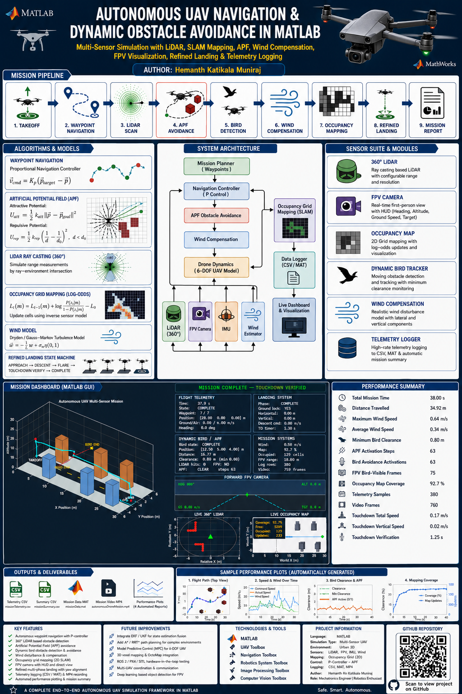
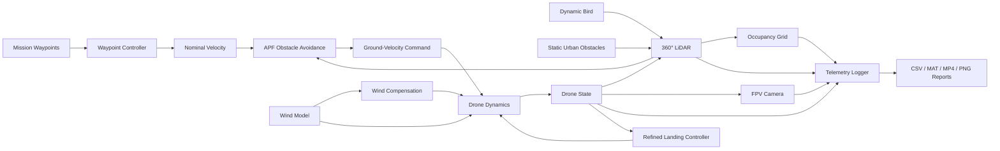

# 🚁 Autonomous UAV Navigation & Dynamic Obstacle Avoidance in MATLAB

<p align="center">
  
</p>

<p align="center">
  
  
  
  
  
</p>

## Project Highlights

- Autonomous takeoff, waypoint navigation, and multi-phase landing
- 360° LiDAR simulation with static and dynamic detections
- Artificial Potential Field obstacle avoidance
- Dynamic bird crossing and real-time avoidance
- Probabilistic occupancy-grid mapping
- Wind, gust, turbulence, and compensation
- FPV camera with HUD, target marker, warnings, and corrected left/right projection
- Landing approach, controlled descent, flare, touchdown verification, and yaw lock
- CSV and MAT telemetry export
- Automatic MP4 mission recording
- Automated performance plots and mission summary

## Final Demonstrated Results

| Metric | Representative Result |
|---|---:|
| Mission completion | Successful |
| Total mission time | ~38.0 s |
| Distance travelled | ~34.9 m |
| Maximum wind speed | ~0.64 m/s |
| Minimum bird clearance | ~0.80 m |
| Bird avoidance activations | ~63 |
| Occupancy-map coverage | ~92.7% |
| Touchdown total speed | ~0.17 m/s |
| Touchdown vertical speed | ~0.02 m/s |
| Telemetry samples | ~380 |
| Video frames | ~760 |

Results may vary slightly because wind turbulence and LiDAR noise are stochastic.

## System Architecture



## Folder Structure

```text
AutonomousDroneMATLAB/
├── main.m
├──asset/
    └── Infographics.png
├── config/
│   └── simulationConfig.m
├── drone/
│   ├── initializeDrone.m
│   ├── updateDroneDynamics.m
│   ├── drawDrone.m
│   └── updateDroneGraphics.m
├── environment/
│   └── createUrbanEnvironment.m
├── navigation/
│   ├── waypointController.m
│   ├── potentialFieldController.m
│   └── refinedLandingController.m
├── sensors/
│   └── simulateLidar.m
├── bird/
│   ├── initializeBird.m
│   ├── updateBird.m
│   ├── drawBird.m
│   └── updateBirdGraphics.m
├── wind/
│   ├── initializeWind.m
│   └── updateWind.m
├── mapping/
│   ├── initializeOccupancyMap.m
│   ├── updateOccupancyMap.m
│   ├── initializeMappingGraphics.m
│   └── updateMappingGraphics.m
├── visualization/
│   ├── initializeLidarGraphics.m
│   ├── updateLidarGraphics.m
│   ├── initializeFPVGraphics.m
│   └── updateFPVGraphics.m
├── logging/
│   ├── initializeMissionRecorder.m
│   ├── recordMissionStep.m
│   └── finalizeMissionRecorder.m
├── reporting/
│   └── generateMissionReportPlots.m
├── scripts/
│   └── validateProject.m
├── docs/
│   ├── ARCHITECTURE.md
│   ├── TEST_PLAN.md
│   └── INTERVIEW_GUIDE.md
└── output/
    ├── data/
    ├── video/
    └── plots/
```

Your folder names may differ slightly. MATLAB uses `addpath(genpath(projectRoot))`, so matching function names and valid paths is more important than matching this exact layout.

## Requirements

Tested with MATLAB R2025b. Core functionality depends on:

- MATLAB
- UAV Toolbox
- Navigation Toolbox
- Robotics System Toolbox

The project also benefits from:

- Lidar Toolbox
- Mapping Toolbox
- Computer Vision Toolbox

## How to Run

1. Open MATLAB.
2. Set the Current Folder to the project root.
3. Run:

```matlab
clear;
clear functions;
close all force;
clc;
main
```

4. Keep the dashboard visible while recording.
5. After completion, inspect:

```text
output/data/missionTelemetry.csv
output/data/missionSummary.csv
output/data/missionData.mat
output/video/autonomousDroneMission.mp4
output/plots/
```

## Validation

Run the included validation script before publishing:

```matlab
run("scripts/validateProject.m")
```

It checks required folders, functions, toolboxes, configuration fields, and generated outputs.

## Key Algorithms

### Waypoint Navigation

The controller computes a velocity command toward the active waypoint and limits it to the configured cruise and maximum speeds.

### Artificial Potential Field Avoidance

The APF controller combines:

- Attractive motion toward the active waypoint
- Repulsive velocity away from nearby obstacles
- Tangential velocity to steer around obstacles
- Emergency scaling for critical clearances

### Occupancy Mapping

Each LiDAR ray updates a log-odds grid:

- Cells before a detected endpoint are marked free
- Static obstacle endpoints are marked occupied
- Dynamic bird detections are not permanently inserted

### Wind Compensation

The wind model combines:

- Mean wind
- Sinusoidal gusts
- Filtered random turbulence

The controller applies feedforward compensation before drone dynamics are updated.

### Refined Landing

The landing sequence contains:

1. Approach and position alignment
2. Yaw alignment
3. Controlled descent
4. Final flare
5. Touchdown detection
6. Touchdown verification
7. Ground lock and final yaw lock

## Known Limitations

- The drone model is kinematic rather than a full six-degree-of-freedom aerodynamic model.
- LiDAR geometry uses simplified obstacle intersections.
- The FPV panel is a geometric projection, not a photorealistic rendered camera.
- APF navigation can be sensitive to gain selection and local minima.
- Dynamic-obstacle prediction is reactive rather than trajectory-predictive.
- Random turbulence can produce small run-to-run variation.

## Suggested Future Work

- A* or RRT* global planning
- Model Predictive Control
- Kalman-filter state estimation
- Multi-obstacle trajectory prediction
- ROS 2 integration
- Simulink or UAV Scenario integration
- Photorealistic Unreal Engine visualization
- App Designer controls
- Automated parameter sweeps and regression testing

## Resume Bullet

Developed a MATLAB-based autonomous UAV simulation integrating 360° LiDAR, APF collision avoidance, dynamic bird avoidance, occupancy-grid SLAM-style mapping, wind compensation, FPV visualization, and multi-phase precision landing; achieved approximately 0.80 m minimum dynamic-obstacle clearance, 92.7% map coverage, and 0.02 m/s touchdown vertical speed while exporting CSV/MAT telemetry and MP4 mission recordings.

## Results
See the infographic above and generated mission video in `output/video`.

## License

This repository is released under the MIT License. See `LICENSE`.

## Author
**Hemanth Katikala Muniraj**
