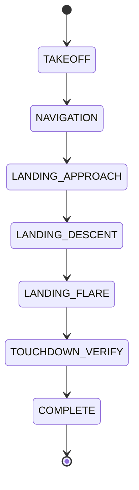

# System Architecture

## Functional Flow

```text
Mission Planner
     |
     v
Waypoint Controller -----
     |                   |
     v                   |
Nominal Velocity         |
     |                   |
     v                   |
APF Avoidance <--- LiDAR <--- Static Obstacles
     ^              ^
     |              |
Dynamic Bird -------+
     |
     v
Final Ground-Velocity Command
     |
     +---- Wind Compensation <--- Wind / Gust / Turbulence
     |
     v
Drone Dynamics
     |
     +----> 3D Visualization
     +----> FPV Camera
     +----> LiDAR Update
     +----> Occupancy Map
     +----> Telemetry Logger
     +----> Refined Landing Controller
```

## Coordinate Frames

### World frame

- X: forward along the road
- Y: lateral across the road
- Z: altitude

### FPV camera frame

- Camera X: forward
- Camera Y: physical right
- Camera Z: upward

For a drone facing world +X:

- World -Y appears on the FPV right
- World +Y appears on the FPV left

## Mission State Machine



## Data Products

- `missionTelemetry.csv`: time-series mission state
- `missionSummary.csv`: one-row mission metrics
- `missionData.mat`: complete MATLAB dataset
- `autonomousDroneMission.mp4`: dashboard recording
- `output/plots/*.png`: automatically generated reports
